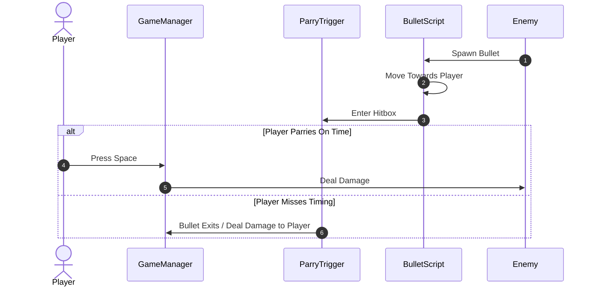

# NOKIA-3310-JAM-8

**Execution Sequence**

An Enemy spawns a Bullet that travels toward the player and enters the ParryTrigger collision zone. The branch evaluates timing—if the Player presses space within the window, the GameManager deals damage to the enemy; otherwise, the bullet exits the trigger and damages the player instead.

**Parry outcomes**
* Standard Parry: Triggered when the bullet is inside either the Early or Late collision zone. Successfully deflects the attack and deals 1 point of damage to the enemy.  
* Perfect Parry: Triggered when the timing is precise enough that the bullet overlaps both the Early and Late zones simultaneously (earlyParryFlag && lateParryFlag). In addition to damaging the enemy, it restores 1 HP to the player.

